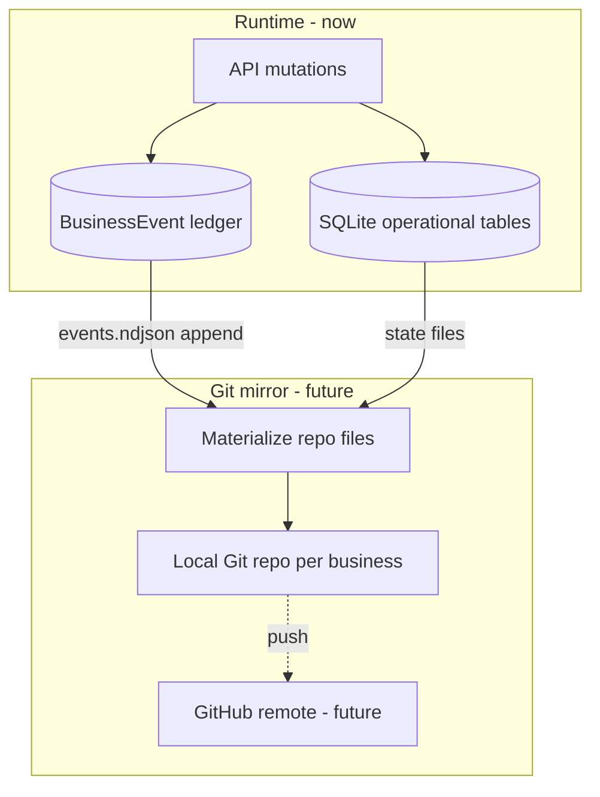
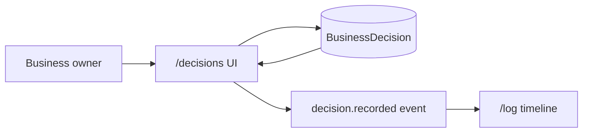

# Business Log + Git Versioning — Design Reference

> **Status:** Architecture reference (not yet implemented).  
> Read alongside the immutable business log plan. Agents implementing log or sync features must consult this file.

---

## 1. Two complementary layers

Hermes Forge will use **two durable representations** of a business. They serve different jobs and reinforce each other.

| Layer | Role | Hot path today | Future |
|-------|------|----------------|--------|
| **SQLite + Business log** | Runtime store + append-only ledger | Primary for UI, APIs, queries | Still primary for live app |
| **Local Git repo per business** | Versioned file snapshot of the company | Not built yet | Durable archive, diff, branches, GitHub sync |

**Neither replaces the other.**

- The **log** answers: *what happened, in what order, when was it recorded vs when did it occur?*
- **Decisions** answer: *what did the business owner choose, why, and when?* (first-class log category + dedicated `/decisions` view)
- **Git** answers: *what did the company look like at commit X, what changed between commits, how do I sync/share it?*



### Recommended authority model

**DB-primary, Git-async mirror** (best fit for Next.js + SQLite):

1. All user actions write to SQLite and append to the business log immediately.
2. A sync job (manual button or debounced) materializes files and creates a Git commit.
3. GitHub push is an optional second step when the user has connected a remote.

Git is **not** on the request hot path. The log’s `sequence` gives Git commits a stable anchor (“this commit includes events 1–57”).

Alternative **Git-primary** (operational state rebuilt from repo) is possible long-term but requires event-sourcing or full materialization on every read — out of scope for Phase 1.

---

## 2. How the planned log design maps to Git

The immutable log plan already includes properties Git needs:

| Log concept | Git use |
|-------------|---------|
| `sequence` (monotonic per business) | Line index in `log/events.ndjson`; commit range `logSequenceFrom..logSequenceTo` |
| `recordedAt` | Append order; matches Git commit author date for sync commits |
| `occurredAt` | Stored in event JSON; not used for Git ordering |
| `BusinessLogBundleV1` export | Canonical serialization → same shape as repo `log/events.ndjson` lines |
| `checksum` on export bundle | Can be stored in `manifest.json` at repo root and in commit message trailer |
| `payloadHash` / `prevPayloadHash` (deferred) | Parallel to Git object hashes; optional cross-anchor to blockchain later |

**Git commit SHA** is already a content-addressed chain. Blockchain anchoring (future) can target either:

- Log bundle checksum at `logHeadSequence`, or
- Git `HEAD` commit SHA after sync

No conflict — pick one anchor target or both.

---

## 3. Repo layout (one Git repo per business)

Each business gets an isolated directory (location TBD: user data dir, e.g. `~/.hermes-forge/businesses/{businessId}/`).

```
{businessId}/
  manifest.json              # bundle version, businessId, logHeadSequence, lastCommitSha, checksum
  business.json              # name, industry, description, goals, ...
  memories.ndjson            # one fact per line
  personnel.json             # array of human personnel
  decisions.ndjson           # owner decisions; one canonical record per line (append-only)
  processes/
    {processId}/
      meta.json              # name, department, status, scores, ...
      diagram.mmd              # Mermaid source
      conversations/
        {conversationId}.ndjson  # chat messages, one JSON per line
  automations/
    {processId}/
      meta.json              # status, planJson refs, externalId, ...
  log/
    events.ndjson            # append-only; one BusinessLogBundle event object per line
```

### File format rules (Git-friendly)

- **NDJSON** for log and chat: append-only, line-oriented, diff-friendly for new tail lines.
- **JSON** for snapshots that replace wholesale on sync (`business.json`, `personnel.json`).
- **Plain text** for diagrams (`.mmd`) — human-readable diffs in GitHub.
- **`manifest.json`** updated on every sync commit with `logHeadSequence`, `gitHeadCommit`, `exportedAt`, `checksum`.

This layout is isomorphic to `BusinessLogBundleV1` + operational export. The pre-delete archive download can zip this tree or emit an equivalent single-file bundle.

---

## 4. Sync semantics

### Initialize (once per business)

1. `git init` in business directory.
2. Write initial files from current DB state.
3. Append all existing log events to `log/events.ndjson` (or replay from DB in sequence order).
4. First commit: `forge: genesis seq=1..N`.
5. Record `gitHeadCommit`, `gitHeadSequence = N`, `gitInitializedAt`, `gitDirty = false`.

### Incremental sync (repeatable)

1. Load `gitHeadSequence` from DB.
2. Fetch events where `sequence > gitHeadSequence`; append lines to `events.ndjson`.
3. Re-materialize changed state files (processes/diagrams touched since last sync — track via log entity refs or `gitDirty` flag).
4. `git add` + `git commit` with message e.g. `forge: events 58-63, update process invoice-flow`.
5. Update `gitHeadCommit`, `gitHeadSequence`, clear `gitDirty`.

### GitHub (future)

- Store `gitRemoteUrl`, `gitRemoteBranch` on Business (or `BusinessGitRemote` table).
- OAuth / PAT via existing BYOK patterns; `git push origin main`.
- `gitLastPushedAt`, `gitLastPushError` for UI status.

### Conflict policy

Single-writer per business (one Forge user/session owns the repo). No merge from GitHub back into DB in v1. Pull/clone is a **restore** operation (new business from repo), not live sync.

---

## 5. Schema additions (include in log migration)

Add these fields in the **same Prisma migration** as the immutable log refactor. All Git fields are nullable / inert until sync is implemented.

### `Business` — log head (from log plan) + Git mirror pointers

```prisma
model Business {
  // ... existing fields ...

  // Immutable log head
  logHeadSequence    Int       @default(0)
  logInitializedAt   DateTime? // replaces backfillCompletedAt

  // Local Git mirror (future sync; no logic in Phase A)
  gitRepoPath        String?   // absolute path to business repo root
  gitInitializedAt   DateTime?
  gitHeadCommit      String?   // last materialized commit SHA
  gitHeadSequence    Int?      // log sequence included in gitHeadCommit
  gitDirty           Boolean   @default(false) // DB/log ahead of Git
  gitRemoteUrl       String?   // future GitHub remote
  gitRemoteBranch    String?   @default("main")
  gitLastPushedAt    DateTime?
  gitLastPushError   String?
}
```

### `BusinessEvent` — log fields (from log plan) + optional Git back-reference

```prisma
model BusinessEvent {
  // ... id, businessId, userId, type, entity*, summary, metadata ...

  sequence              Int
  recordedAt            DateTime
  occurredAt            DateTime?
  occurredAtPrecision   String    @default("unknown") // exact | approximate | unknown
  ingestion             String    @default("live")    // live | backfill | import

  // Hash chain (deferred computation)
  payloadHash           String?
  prevPayloadHash       String?

  // Set when event is first included in a Git commit (optional denorm)
  gitCommitSha          String?

  @@unique([businessId, sequence])
  @@index([businessId, recordedAt(sort: Desc)])
}
```

### Optional: `BusinessGitCommit` (defer table until sync UI)

If commit metadata needs rich querying before sync ships, add later:

```prisma
model BusinessGitCommit {
  id              String   @id @default(cuid())
  businessId      String
  commitSha       String
  parentSha       String?
  logSequenceFrom Int
  logSequenceTo   Int
  message         String
  recordedAt      DateTime @default(now())
  pushedAt        DateTime?

  @@unique([businessId, commitSha])
  @@index([businessId, logSequenceTo(sort: Desc)])
}
```

**Phase A recommendation:** Business-level pointers only (`gitHeadCommit`, `gitHeadSequence`). Add `BusinessGitCommit` when building sync history UI.

### `BusinessDecision` — owner decisions (schema in log migration)

Decisions are a **first-class domain object** for governance: what the business owner chose, with rationale and context. They are stored for query on `/decisions` and **always mirrored** in the append-only business log.

```prisma
model BusinessDecision {
  id                    String    @id @default(cuid())
  businessId            String
  business              Business  @relation(fields: [businessId], references: [id], onDelete: Cascade)

  decidedByUserId       String?   // business owner / acting user
  title                 String
  statement             String    // the decision itself
  rationale             String?
  context               String?

  status                String    @default("active") // active | superseded | revoked
  decidedAt             DateTime? // when the decision was made (occurred time; nullable)
  recordedAt            DateTime  @default(now())   // when first persisted in Forge

  relatedEntityType     String?   // process | personnel | business | ...
  relatedEntityId       String?
  supersededByDecisionId String?

  logSequence           Int?      // sequence of decision.recorded event that created this row

  createdAt             DateTime  @default(now())
  updatedAt             DateTime  @updatedAt  // status-only updates via supersede/revoke flow

  @@index([businessId, recordedAt(sort: Desc)])
  @@index([businessId, status])
  @@index([businessId, decidedAt(sort: Desc)])
}
```

Add `decisions BusinessDecision[]` to `Business`.

**Immutability rule:** The decision *content* (`statement`, `rationale`, `context`) is not edited in place. Corrections append new log events (`decision.superseded`, `decision.revoked`) and update `status` / `supersededByDecisionId` on the operational row only.

#### Log events (`decision.*`)

| Event | When |
|-------|------|
| `decision.recorded` | Owner records a new decision |
| `decision.superseded` | Owner replaces a prior decision with a new one |
| `decision.revoked` | Owner explicitly withdraws a decision |

- `entityType`: `decision`
- `entityId`: `BusinessDecision.id`
- `entityName`: decision `title`
- `summary`: human-readable, e.g. `Decided to outsource payroll processing`
- `metadata`: full `DecisionEventMetadata` — see [`lib/decision-types.ts`](../../lib/decision-types.ts)
- `occurredAt`: `decidedAt` when known; else null
- `occurredAtPrecision`: `exact` if owner supplied date, else `unknown`

#### Dual timestamps for decisions

| Field | Source |
|-------|--------|
| Log `recordedAt` | When Forge appended the `decision.*` event |
| Log `occurredAt` | Owner-supplied `decidedAt`, or null if unknown |
| `BusinessDecision.decidedAt` | Same as log `occurredAt` |
| `BusinessDecision.recordedAt` | When the decision row was first created |

Past decisions ingested without a known date: `decidedAt = null`, `occurredAtPrecision = unknown`. Timeline on `/log` still sorts by log `recordedAt`.

#### UI routes

| Route | Purpose | Status |
|-------|---------|--------|
| `/decisions` | Decision register — list, detail, record (future) | **Placeholder** (blank page shipped) |
| `/log` filter `decision` | Condensed timeline of `decision.*` events | Filter wired; no events yet |

Decisions page is the **curated register** (active decisions, detail, rationale). Business log is the **chronological proof** that a decision was recorded at a point in time.



#### TypeScript contracts (shipped)

- [`lib/decision-types.ts`](../../lib/decision-types.ts) — `BusinessDecisionRecord`, `DecisionEventMetadata`
- [`lib/business-log-types.ts`](../../lib/business-log-types.ts) — `DECISION_*` event constants, `decision` filter category

---

## 6. Interaction with export-then-delete

| Step | Log | Git |
|------|-----|-----|
| User exports archive | `BusinessLogBundleV1` JSON or zip of repo layout | If repo exists, `git archive` or copy tree |
| Delete gate | Require export `checksum` | Optional: require `gitHeadCommit` matches DB `gitHeadSequence` (repo fully synced) |
| After delete | Rows gone; user keeps file | Local repo directory may be kept on disk or offered for deletion separately |

Export checksum and Git `HEAD` can both satisfy “you have a durable copy” before delete.

---

## 7. What to build now vs later

### Include in immutable log Phase A (schema only)

- All log fields: `sequence`, `recordedAt`, `occurredAt`, `occurredAtPrecision`, `ingestion`
- `logHeadSequence`, `logInitializedAt` on Business
- Git pointer fields on Business (`gitRepoPath` through `gitLastPushError`) — **columns only, no runtime use**
- `gitCommitSha` nullable on BusinessEvent
- `payloadHash` / `prevPayloadHash` nullable on BusinessEvent
- `BusinessDecision` table (empty until record UI ships; no breaking runtime dependency)

### Phase A implementation (no Git code)

- `recordBusinessEvent` sets `gitDirty = true` on Business (one extra field in append transaction) — optional cheap hook
- Canonical event JSON serializer shared by export bundle and future `events.ndjson`

### Shipped (Git sync scaffolding)

| Item | Location |
|------|----------|
| Repo paths | `lib/business-git/paths.ts` — `~/.hermes-forge/businesses/{id}` or `HERMES_FORGE_DATA_DIR` |
| Materialize | `lib/business-git/materialize.ts` — full repo layout from DB |
| Sync | `lib/business-git/sync.ts` — `git init`, materialize, commit, update pointers |
| API | `GET/POST/PATCH /api/businesses/[id]/git` |
| UI | Profile page — per-business Git sync button + status |
| Desktop | `electron/main.mjs` sets `HERMES_FORGE_DATA_DIR` |

### Later phases

| Phase | Work |
|-------|------|
| Incremental materialize | Append log tail only; skip full rewrite |
| GitHub push | OAuth/PAT, `git push`, `gitLastPushedAt` |
| Restore from repo | Import business from cloned repo |
| `BusinessGitCommit` table | Commit history in UI |
| Decision recording UI | `POST /api/decisions`, list on `/decisions`, `decision.recorded` log append |
| Decision supersede / revoke | `decision.superseded`, `decision.revoked` events |

---

## 8. Compatibility verdict

**The immutable business log plan and Git-per-company versioning are compatible.**

- Log = ordered, append-only **event** history (fine-grained).
- Git = ordered, snapshot **state** history (coarse-grained commits).
- `sequence` bridges them: every Git commit records which log sequences it includes.
- Export bundle format doubles as the on-disk log line schema.
- Schema stubs added now cost nothing at runtime and avoid a second migration when Git ships.

**Do not** store the company only in Git without the DB log — the app needs fast queries and the timeline UI. **Do not** drop Git in favor of log-only — users want version control, diffs, and GitHub. Build both, sync asynchronously.

---

## 9. Agent checklist

When implementing business log changes:

1. Use `recordedAt` for timeline order; never use `occurredAt` for sort.
2. Assign `sequence` atomically; never reuse or gap-fill.
3. Serialize events with the canonical function in `lib/business-log-export.ts` (shared with future Git).
4. Do not implement Git commands in Phase A unless explicitly tasked.
5. When adding Git sync, read this file and the immutable log plan together.
6. Owner decisions use `decision.*` log events + `BusinessDecision` rows; never edit decision content in place — supersede or revoke via new events.
7. `/decisions` is the register; `/log?filter=decision` is the chronological trail. Keep both in sync on every write.