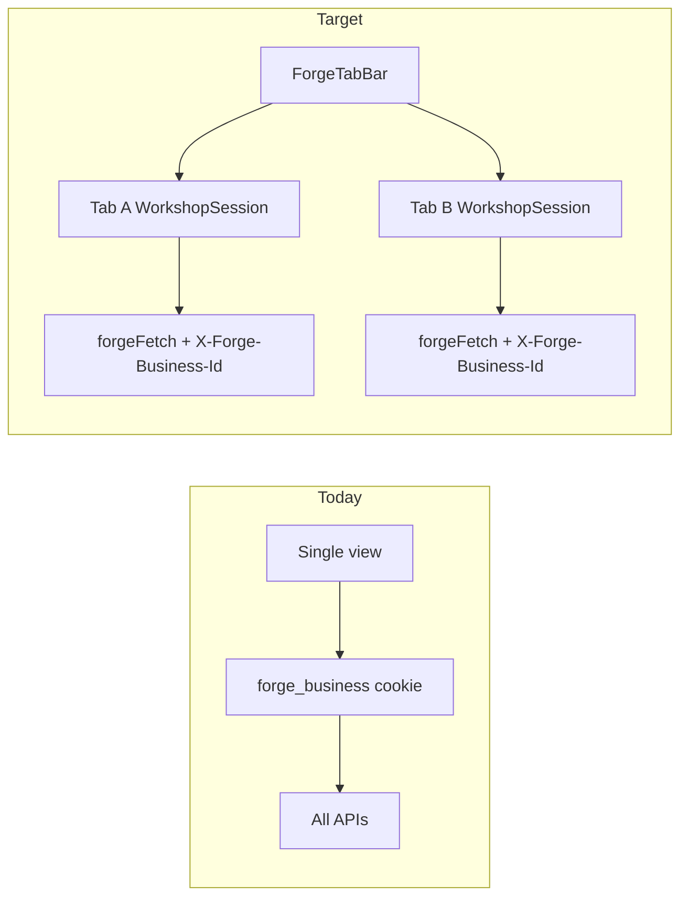
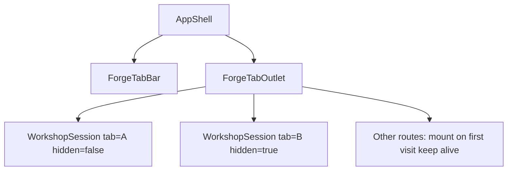

# Desktop Multi-Tab Shell

**Status:** Phase 1–3 shipped (tabs, parallel workshops, polish). Optional future: automation multi-mount.  
**Surface:** Desktop app only (Electron)  
**Goal:** Notion-style tab bar so users can run multiple live sessions in parallel — different businesses, processes, or shell routes — with background Hermes chat/diagram streams continuing while working in another tab.

---

## Problem

Today the app is a **single-session SPA**:

- One Electron `BrowserWindow` loads one Next.js renderer (`electron/main.mjs`)
- **One global active business** via `forge_business` cookie (`lib/auth.ts`, `app/api/businesses/active/route.ts`)
- `ShellContext` exposes a single `currentBusiness`
- Workshop state is one React tree in `app/(shell)/workshop/page.tsx` (~985 lines) with live SSE chat/diagram streams
- Existing "tabs" (`WorkspaceTabs`) are **in-page panels**, not app-level navigation

Switching business today calls `switchBusiness()` which rewrites the cookie and `router.refresh()`, so a second live context cannot coexist.



## Recommended approach (desktop-only, true parallel)

**In-renderer tab manager** — not Electron `BrowserView` partitions.

| Approach | Why not chosen |
|----------|----------------|
| Electron `BrowserView` per tab | Duplicates entire app + providers; Hermes/theme diverge per partition; heavy memory |
| Cookie swap on tab activate | Background tabs cannot keep streaming |
| **Mounted `WorkshopSession` per tab + business header** | Shared Hermes/theme providers; true parallel streams; fits existing React shell |

Gate the feature behind `isForgeDesktop()` (`lib/forge-desktop.ts`). Web keeps current single-session behavior.

---

## Architecture

### 1. Tab model and persistence

New module `lib/forge-tabs/types.ts`:

```ts
type ForgeTab = {
  id: string;
  title: string;           // e.g. "Acme Corp · Onboarding"
  route: string;           // "/workshop", "/functions", "/automations/[id]", etc.
  businessId: string;
  businessName: string;
  processId?: string;
  workspaceTab?: WorkspaceTab; // diagram | details | ...
  automationProcessId?: string;  // for /automations/[processId]
};
```

- `lib/forge-tabs/storage.ts`: persist tab list + active tab id in `localStorage` (`forge-tabs:v1`)
- On desktop boot: restore tabs or seed one tab from current route + `currentBusiness`

### 2. Tab provider and chrome

New `components/shell/ForgeTabProvider.tsx` (child of `ShellProvider` in `AppShell.tsx`):

- `tabs`, `activeTabId`, `createTab`, `closeTab`, `activateTab`, `updateActiveTab`
- `openInNewTab(route, snapshot?)` — used by context menus / Ctrl+click
- `navigateActiveTab(route)` — replaces global `router.push` for shell nav when tabs enabled

New `components/shell/ForgeTabBar.tsx`:

- Horizontal strip at the **top** of the main column, above `AppTopBar` (browser-style chrome)
- Tab pill: title, close button, optional business initial
- `+` opens duplicate of current context or `/home`
- Middle-click / Ctrl+W close; Ctrl+T new; Ctrl+Tab cycle
- Styles in `app/globals.css` using existing tokens

`BusinessSwitcher` behavior when tabs on:

- Switching business updates **active tab only** (via `updateActiveTab` + scoped fetch), not global cookie
- Optional: hide switcher when tab bar shows business in each pill

### 3. Business scoping without global cookie (critical)

Add header constant in `lib/auth-session.ts`:

```ts
export const BUSINESS_HEADER = 'x-forge-business-id';
```

Update `getActiveBusinessForUser` in `lib/auth.ts`:

```ts
// Priority: explicit header > cookie > newest business fallback
const businessId =
  request?.headers.get(BUSINESS_HEADER) ??
  (await getActiveBusinessId(request));
```

New `lib/forge-fetch.ts`:

```ts
forgeFetch(input, { businessId, ...init }) // injects BUSINESS_HEADER
```

Update ~14 list/scoped API routes that call `getActiveBusinessForUser` (processes, personnel, automations, business log, etc.) — no route signature changes needed if all client calls pass the header.

**Process-scoped routes** (`requireProcessAccess` in `lib/auth.ts`): relax to resolve process by `processId + userId` directly (process already carries `businessId`). This lets background workshop tabs call `/api/processes/[id]/chat` without fighting the cookie.

Keep `POST /api/businesses/active` for web/back-compat; desktop tab flows stop depending on it.

### 4. Multi-mounted content outlet

New `components/shell/ForgeTabOutlet.tsx` replaces the naive `{children}` render path when desktop tabs are on:



**Parallel-capable routes** (always mounted once visited, toggled via `hidden` / `visibility`):

| Route | Component |
|-------|-----------|
| `/workshop` | `WorkshopSession` (extracted) |
| `/automations/[processId]` | `AutomationStudioSession` (extract later; phase 2b) |

**Non-parallel routes** (`/functions`, `/personnel`, `/log`, etc.):

- Mount lazily per tab on first visit; keep alive after
- Lower priority: can initially **navigate-only** (remount on activate) if needed to reduce scope

Extract `components/workshop/WorkshopSession.tsx` from `workshop/page.tsx`:

- Props: `tabId`, `businessId`, `businessName`, initial `processId?`, `workspaceTab?`, `isActive`
- Replace `useShell().currentBusiness` with props
- Replace raw `fetch(...)` with `forgeFetch(..., { businessId })`
- When `isActive` is false: keep streams running but pause expensive UI work (optional `requestAnimationFrame` throttle for diagram)
- `workshop/page.tsx` becomes a thin desktop-aware wrapper

### 5. Navigation integration

Update `NavRail.tsx`:

- Desktop + tabs enabled: `onClick` → `navigateActiveTab(href)` instead of `<Link>`
- Active highlight derives from **active tab's route**, not `usePathname()` alone

Update cross-page jumps (`home`, `functions`):

- "Open in new tab" action (context menu or Ctrl+click) calls `openInNewTab('/workshop', { businessId, processId })`
- Default click still activates current tab

### 6. Electron layer

**No main-process changes required** for v1. The existing single `BrowserWindow` + preload bridge is sufficient because parallelism lives in React.

**Custom title bar (shipped):** `BrowserWindow` is **frameless** (`frame: false`). Min / maximize / restore / close are HTML controls folded into the topmost chrome row:

| Surface | Drag region + window controls |
|---------|-------------------------------|
| ≥2 tabs | `ForgeTabBar` (trailing, after notification bell) |
| 1 tab | `AppTopBar` actions |
| Full-bleed (`/business-manager`, `/setup/*`) | `DesktopDragChrome` strip |
| Auth / startup (outside shell) | `DesktopOutsideShellChrome` |

Bridge: `window.forgeDesktop.window.{minimize,maximizeToggle,close,isMaximized,onMaximizedChange}` (`electron/main.mjs` + `preload.cjs`). Drag via CSS `-webkit-app-region: drag` / `no-drag` on interactive children.

Optional later polish:

- `setWindowOpenHandler` could offer "open in Forge tab" via IPC instead of always `shell.openExternal`
- macOS traffic-light insets when mac packaging ships

---

## Implementation phases

### Phase 1 — Foundation (unblocks everything)

- `ForgeTab` types + storage + provider
- `forgeFetch` + `BUSINESS_HEADER` auth resolution
- `ForgeTabBar` UI (desktop-gated)
- Seed/restore tabs on launch
- Tab activate updates visible outlet; **workshop still single instance** (validates tab UX)

### Phase 2 — True parallel workshop

- Extract `WorkshopSession`
- `ForgeTabOutlet` mounts N sessions, keeps inactive mounted
- Rewire workshop fetches/SSE to `forgeFetch`
- Fix `requireProcessAccess` to be process-direct
- NavRail + cross-links tab-aware

### Phase 3 — Polish

- Keyboard shortcuts, drag-reorder tabs, tab context menu ("Duplicate", "Close others")
- `openInNewTab` from Business Manager / Functions / Home cards
- Automation studio session extraction (if users need parallel automation design)
- Memory guard: warn or offer "unload inactive tab" after N tabs

---

## Key risks and mitigations

| Risk | Mitigation |
|------|------------|
| Memory with N full workshop sessions | Desktop-only; default max ~8 tabs; unload LRU inactive tabs |
| Missed `fetch` calls bypassing header | Codemod + lint rule: use `forgeFetch` in tab-scoped components |
| Next.js `usePathname()` desync | Tab outlet owns content; pathname only for initial seed |
| Background SSE/chat noise | Optional: mute toast notifications for inactive tabs |
| Web regression | Feature entirely behind `isForgeDesktop()` |

---

## Files to touch (primary)

| Area | Files |
|------|-------|
| Tab system | `lib/forge-tabs/*`, `components/shell/ForgeTabProvider.tsx`, `ForgeTabBar.tsx`, `ForgeTabOutlet.tsx` |
| Shell | `AppShell.tsx`, `NavRail.tsx`, `BusinessSwitcher.tsx` |
| Auth/API | `lib/auth.ts`, `lib/auth-session.ts`, `lib/forge-fetch.ts`, ~14 `app/api/**` routes |
| Workshop | `WorkshopSession.tsx` (new), `workshop/page.tsx` |
| Styles | `app/globals.css` |

---

## Success criteria

- User can open Tab A (Business X, Process 1) and Tab B (Business Y, Process 2) in desktop
- Hermes chat + diagram stream in Tab A continues while user interacts with Tab B
- Tab labels reflect business + process context
- Tab set restores after app restart
- Web build unchanged (no tab bar, cookie model preserved)

---

## Implementation checklist

- [x] **tab-model** — Add ForgeTab types, localStorage persistence, and ForgeTabProvider (desktop-gated)
- [x] **business-header** — Add `X-Forge-Business-Id` header support in `lib/auth.ts` + `lib/forge-fetch.ts` (header wins over cookie via `getActiveBusinessId`)
- [x] **tab-bar-ui** — Build ForgeTabBar in AppShell with create/close/activate and keyboard shortcuts (Ctrl+T/W/Tab)
- [x] **workshop-extract** — Extract WorkshopSession from `workshop/page.tsx`; wire forgeFetch and tab props
- [x] **tab-outlet** — Implement ForgeTabOutlet with multi-mounted sessions and tab-aware NavRail navigation
- [x] **process-access** — Relax `requireProcessAccess` to resolve by processId+userId (not cookie business)
- [x] **polish** — Drag-reorder, context menu (Duplicate / Close others / Unload), open-in-new-tab from Home/Functions/Business Manager, LRU workshop unload soft-max, inactive-tab toast mute. Automation multi-mount still optional.

---

## Agent handoff

When implementing this feature:

1. Read this document and backlog item **4.15** in `PRODUCT_BACKLOG.md`
2. Implement in phase order (1 → 2 → 3); do not skip the business-header work — it unblocks true parallel tabs
3. Gate all UI behind `isForgeDesktop()`; verify web build behavior unchanged
4. Run `npm run build` before marking done
5. Update checklist items and backlog status as phases complete