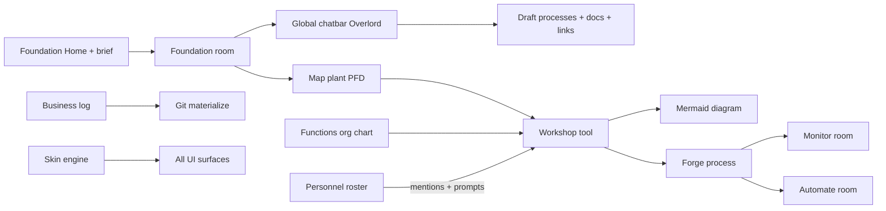
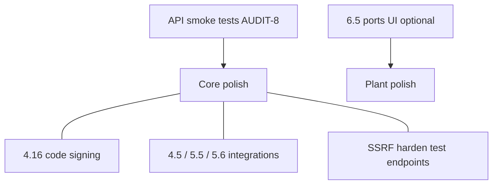

# Hermes Forge — Project Audit

**Version audited:** v0.3.4 (+ Phase 6 plant / entry)  
**Audit date:** 2026-07-07  
**Last remediation update:** 2026-07-22 (4.19 unified chatbar dual-stack cleanup; see [Remediation progress](#remediation-progress))

This document is the canonical repo health audit. It complements [`PRODUCT_BACKLOG.md`](PRODUCT_BACKLOG.md) (what to build) with an honest picture of mistakes, gaps, redundancy, and cleanup work.

---

## Remediation progress

Tracked in backlog as **AUDIT-1 … AUDIT-11** ([`PRODUCT_BACKLOG.md`](PRODUCT_BACKLOG.md#audit-remediation-2026-07-07)).

| ID | Task | Status | Notes |
|----|------|--------|-------|
| AUDIT-1 | Align `PRODUCT_BACKLOG.md` baseline with codebase | **Done** | Terminology section, 4.10–4.14, redirects, nav |
| AUDIT-2 | Personnel honesty pass | **Done** | Hire dialog + page copy; `[FIRE]` placeholders; `PersonnelIcon` removed; scaffold banner |
| AUDIT-3 | Remove legacy Interview flow | **Done** | Deleted `app/interview/page.tsx`, `app/api/extract/route.ts`; `/interview` → `/home` |
| AUDIT-4 | Merge Dashboard into Functions | **Done** | Org chart + analytics on `/functions`; dashboard page deleted; `/dashboard` → `/functions` |
| AUDIT-5 | Dev-gate God Mode | **Done** | Nav hidden by default; Settings → Developer toggle; route guard (Map plant promotes God Mode for product) |
| AUDIT-6 | Dead code cleanup | **Mostly done** | accent.ts removed; next.config.mjs removed; accent-swatch CSS removed; optional theme export prune remains |
| AUDIT-7 | Schema honesty | **Done** | Decisions HITL API + UI + `decision.*` events (4.12); personnel git import done |
| AUDIT-8 | Repo hygiene | **Mostly done** | WAL gitignored; expanded `npm test` unit suite (plant, rooms, pending-studio-reply, …); HTTP API smoke still optional |
| AUDIT-9 | Terminology pass | **Done** | `NewBusinessDialog`, shell `openNewBusiness`, auth copy, `process-card` / `recent-processes` CSS |
| AUDIT-10 | Personnel workshop integration | **Done** | @-mentions + chat/diagram prompts + swimlane lanes; human edit PATCH; personnel git import; automation agent bind; `@system` via 3.5 |
| AUDIT-11 | Next.js 16 `middleware` → `proxy` | **Done** (2026-07-19) | Deprecated middleware broke public Hermes/auth API routes (HTML 404 → client `Unexpected token '<'`); `proxy.ts` restores JSON |

---

## What you've actually built

Hermes Forge is a **v0.3.x agent-native business process mapping studio** with a **plant / room IA** (Phase 6) and a strong core loop.

**Solid and shippable:**
- **Phase 6 plant path:** Foundation Home Send → Foundation + **studio chat seeded with Overlord auto-reply** (`start-from-brief` + `pendingStudioReply` + chatbar `replyOnly`)
- Foundation room, plant tools (`forge-drafts` / `forge-docs` / `forge-links` auto-apply), Map plant (layout modes, export, outside I/O), per-room Homes, soft unlock on forged
- Workshop depth: streaming diagrams, node comments, discovery questions, forks, message queue, rich composer, process-chat in global chatbar
- Automations pipeline (approval → studio → Hermes cron / n8n deploy) — 4.4 / 5.3 M0
- Business log + append-only events; Documents knowledge layer; PROCESS.md
- Full theme/skin engine (built-ins incl. Nous art, JSON install, VS Code import)
- Electron desktop packaging + multi-tab shell (4.15)
- Functions page: org chart + automation analytics
- Forge Overlord first-run + lazy hire into chatbar

**Optional / residual gaps (not “fake finished”):**
- ~~Automate **pause/resume + owner run health**~~ → **7.1 Done**
- Process-link **ports UI** (metadata exists; no UI)
- `@system` mention polish residual if any; template marketplace; integrations page

**Dev-gated tooling:**
- Cronalytics — Hermes cron observability (4.14)
- Some God Mode–only extras remain under Developer settings; product Map uses plant canvas

**Shipped governance:**
- Decisions / HITL — forge lifecycle, pending inbox, notifications, `decision.*` log events (4.12)

---

## Most glaring mistakes

### 1. Feature islands — largely fixed

| Feature | Risk | Current state |
|---------|------|---------------|
| Personnel | Hire copy implied workshop assignment | **Fixed** — workshop mentions + prompts; automation bind done |
| Swimlane standard | Lanes from roster | **Partial** — diagram prompt prefers roster lanes when standard is swimlane/auto |
| Rich composer `@` mentions | Actor/department/system | **Mostly done** — actors + roles + systems + diagram nodes |
| BusinessDecision | Governance record | **Done** (4.12) |
| Git `personnel.json` | Round-trip import | **Done** (4.11) |
| Home brief “lost” | Conversation only on process thread | **Fixed** (2026-07-19) — studio seed + chatbar open + Overlord replyOnly |

### 2. Documentation drift — **keep maintaining**

Baseline updated 2026-07-07; Phase 6 + entry continuity updated **2026-07-19**. Keep backlog in sync when shipping features outside numbered items.

### 3. Terminology chaos — **UI pass done (AUDIT-9)**

| Concept | Database | UI label |
|---------|----------|----------|
| Tenant | `Business` | "business" (legacy: "project" in some file names) |
| Workflow map | `Process` | "process" |
| Department | `Process.department` | "function" |
| Shell mode | `ForgeStage` | "room" (Phase 6) |

### 4. Nav rail overload — **addressed via rooms (6.6)**

Room switcher + stage-scoped nav; soft locks for Monitor/Automate; Log + Decisions in footer. Cronalytics remains dev-gated.

### 5. Legacy discovery flow — **fixed (AUDIT-3)**

Interview + `/api/extract` removed. Primary flow: Foundation Home → `start-from-brief` → **Foundation + studio chat** (Workshop is deep-link / refine path).

### 6. Schema ahead of product — **fixed for decisions (AUDIT-7)**

HITL runtime complete. Inert Git mirror fields on `Business` unchanged (low priority).

### 7. Automated tests — **partial (AUDIT-8)**

Unit smoke suite expanded (`npm test` — plant, rooms, foundation, pending-studio-reply, etc.). No HTTP/SSE/Electron integration tests yet.

### 8. Repo hygiene — **mostly done (AUDIT-8)**

SQLite WAL sidecars gitignored; duplicate next.config removed; accent module removed.

### 9. Theme over-investment vs. BPM backlog — **partially addressed**

Skins / VS Code import remain product surface. PROCESS.md, templates, plant export shipped. Optional preset prune remains.

### 10. Security footgun on test endpoints — **open**

`/api/hermes/test` and `/api/n8n/test` accept arbitrary `baseUrl` (SSRF risk on shared hosts). Low urgency for pure local desktop BYOK; fix before multi-tenant/hosted.

### 11. Next.js 16 middleware deprecation — **fixed (AUDIT-11)**

`middleware.ts` renamed to `proxy.ts` (`export async function proxy`). Prevents Hermes discover/test and auth/me from returning HTML 404s under Next 16.2.x.

---

## Missing features

### From backlog — still pending or partial

| ID | Item | Status |
|----|------|--------|
| 2.4 | Function status lifecycle badges | Deferred |
| 3.5 | Rich composer residual (`/export` args optional) | Mostly done |
| 4.3 | Template marketplace / import | Pending |
| 4.5 | Integrations page | Pending |
| 4.16 | Windows installer code signing | Planned |
| 5.5 | n8n Automate expansion | Pending (M1) |
| 5.6 | Notion / external connectors | Pending (M2) |
| 6.5 | Ports UI on plant edges | Optional residual |
| 6.8 | Deeper unique room-home content | Optional residual |
| 7.1 | Automate pause/resume + run health | **Done** (2026-07-19) |

### Needed for product coherence (not all in backlog)

1. ~~Personnel ↔ process / automation~~ mostly done  
2. ~~BusinessDecision implementation~~ done  
3. ~~Git import round-trip~~ done  
4. ~~Home → Foundation chat continuity~~ done (2026-07-19)  
5. `ARCHITECTURE.md` reference doc still optional (`PROCESS.md` + plant ref shipped)  
6. Minimal HTTP API smoke tests  

---

## Redundant or safe to remove

### High confidence — dead code

| Item | Path | Status |
|------|------|--------|
| `HumanPersonnelCard` | `components/personnel/HumanPersonnelCard.tsx` | **Removed** |
| `PersonnelIcon` | `components/personnel/PersonnelIcon.tsx` | **Removed** |
| Interview page + extract API | `app/interview/`, `app/api/extract/` | **Removed** |
| Dashboard page | `app/(shell)/dashboard/page.tsx` | **Removed** |
| Accent preset API | `lib/accent.ts` | **Removed** |
| Dead accent swatch CSS | `app/globals.css` | **Removed** |
| Duplicate Next config | `next.config.mjs` | **Removed** |
| `PERSONNEL_REMOVED` event | `lib/business-log-types.ts` | **Removed** |
| Deprecated `middleware.ts` | root | **Migrated** to `proxy.ts` (AUDIT-11) |
| Dual chat stacks (`ProcessChat` / `AutomationChat` embeds, `process-session` / `automation-session`, `forge.chatbar.unifiedWorkshop` flag) | chatbar + workshop | **Removed** (4.19 Task 9) — single `ChatbarPanel` + `pageModule` pins |
| Unused theme exports | `lib/themes/*` | Pending optional prune |

### Medium confidence

| Item | Recommendation | Status |
|------|----------------|--------|
| God Mode pure-dev nav | Dev-gate extras; Map owns plant | **Done** for product plant |
| Dashboard | Merge into Functions | **Done** |
| Duplicate skin picker | `SettingsMenu` → `<SkinPicker compact />` | Pending |
| `ThemeDesignSystemPreview` | Dev-gate or remove | Pending |
| Overlapping skin presets | Consolidate | Pending |

### Low confidence — keep, don't expand until needed

Cronalytics (dev-gated), VS Code theme import, optional theme export pruning.

---

## Recommended priority (remaining)

1. **AUDIT-8 residual** — optional HTTP-level API smoke  
2. **4.16** code signing when cutting public desktop releases  
3. **4.5 / 5.5 / 5.6** integrations when expanding beyond Hermes-only loop  
4. Optional: plant ports UI, unique room-home content, theme dead-code prune, SSRF on test routes  

**Do not prioritize:** hard Home→Foundation dissolve (explicitly won’t do).

---

## Session notes (2026-07-19)

- Fixed Home Send dropping the conversation: seed **studio** thread + open chatbar + Overlord `replyOnly`  
- Fixed connection screen `Unexpected token '<'`: migrate auth gate to Next 16 **`proxy.ts`**; harden Hermes client JSON parsing  
- Phase 6 planned items treated complete  
- **7.1 shipped:** Hermes pause/resume + owner run health (list + studio) + `automation_run_failed` soft alerts (no Cronalytics required)
