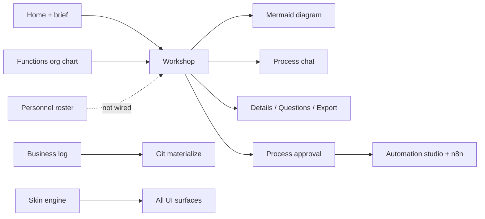
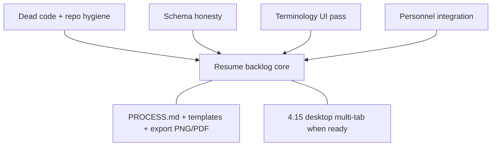

# Hermes Forge — Project Audit

**Version audited:** v0.2.0 (+ post-release WIP)  
**Audit date:** 2026-07-07  
**Remediation session:** 2026-07-07 (see [Remediation progress](#remediation-progress) below)

This document is the canonical repo health audit. It complements [`PRODUCT_BACKLOG.md`](PRODUCT_BACKLOG.md) (what to build) with an honest picture of mistakes, gaps, redundancy, and cleanup work.

---

## Remediation progress

Tracked in backlog as **AUDIT-1 … AUDIT-10** ([`PRODUCT_BACKLOG.md`](PRODUCT_BACKLOG.md#audit-remediation-2026-07-07)).

| ID | Task | Status | Notes |
|----|------|--------|-------|
| AUDIT-1 | Align `PRODUCT_BACKLOG.md` baseline with codebase | **Done** | Terminology section, 4.10–4.14, redirects, nav |
| AUDIT-2 | Personnel honesty pass | **Done** | Hire dialog + page copy; `[FIRE]` placeholders; `PersonnelIcon` removed; scaffold banner |
| AUDIT-3 | Remove legacy Interview flow | **Done** | Deleted `app/interview/page.tsx`, `app/api/extract/route.ts`; `/interview` → `/home` |
| AUDIT-4 | Merge Dashboard into Functions | **Done** | Org chart + analytics on `/functions`; dashboard page deleted; `/dashboard` → `/functions` |
| AUDIT-5 | Dev-gate God Mode | **Done** | Nav hidden by default; Settings → Developer toggle; route guard |
| AUDIT-6 | Dead code cleanup | **Partial** | `PersonnelIcon`, `HumanPersonnelCard` removed; accent legacy, duplicate `next.config`, theme dead exports remain |
| AUDIT-7 | Schema honesty | **Pending** | `BusinessDecision` still schema-only; `PERSONNEL_REMOVED` unused; personnel git import missing |
| AUDIT-8 | Repo hygiene | **Pending** | `*.db-shm` / `*.db-wal` gitignore; no API smoke tests |
| AUDIT-9 | Terminology pass | **Pending** | "Project" still in `RecentProjectsStrip`, `NewProjectDialog` |
| AUDIT-10 | Personnel workshop integration | **Deferred** | Honesty pass chosen over wiring mentions/swimlanes/automation binding |

---

## What you've actually built

Hermes Forge is a **v0.2.0 agent-native process-mapping studio** with a strong core loop and substantial peripheral surface area.

**Solid and shippable:**
- Home → brief → workshop flow (`app/api/start-from-brief/route.ts`, `components/home/HomeHero.tsx`)
- 3-column workshop: streaming diagrams, node comments, discovery questions, conversation forks, message queue, rich composer (`app/(shell)/workshop/page.tsx`)
- Automations pipeline (approval → studio → n8n deploy) — backlog 4.4
- Business log + append-only events (`lib/business-log.ts`, `app/(shell)/log/page.tsx`)
- Full theme/skin engine (built-ins, JSON install, VS Code import) — backlog 4.6–4.9
- Electron desktop packaging (`electron/main.mjs`)
- Functions page: org chart + merged automation analytics (`app/(shell)/functions/page.tsx`, `components/functions/*`)

**Scaffold / disconnected (do not treat as complete):**
- Personnel — roster UI/API only; not wired to workshop, swimlanes, or automations (4.10)
- BusinessDecision — Prisma model only; no API (4.12)

**Dev-gated tooling:**
- God Mode — diagram canvas overview (4.13)
- Cronalytics — Hermes cron observability (4.14)
- Decisions — placeholder page (4.12)

---

## Most glaring mistakes

### 1. Feature islands — UI promises integration that doesn't exist (highest impact)

Features that look finished in navigation but don't participate in the core value chain.

| Feature | Risk | Current state (post-remediation) |
|---------|------|--------------------------------|
| Personnel | Hire copy implied workshop assignment | **Fixed** — honesty pass; still not integrated |
| Swimlane standard | Lanes from roster | **Open** — not implemented |
| Rich composer `@` mentions | Actor/department/system | **Open** — diagram nodes only (3.5) |
| BusinessDecision | Governance record | **Open** — schema only |
| Git `personnel.json` | Round-trip import | **Open** — export only |

### 2. Documentation drift — **largely fixed (AUDIT-1)**

`PRODUCT_BACKLOG.md` baseline was stale (old `/projects` paths, missing personnel/log/themes). Baseline and terminology section updated 2026-07-07. Keep backlog in sync when shipping features outside numbered items.

### 3. Terminology chaos — **documented; UI pass pending (AUDIT-9)**

| Concept | Database | UI label |
|---------|----------|----------|
| Tenant | `Business` | "business" (legacy: "project" in some components) |
| Workflow map | `Process` | "process" |
| Department | `Process.department` | "function" |

### 4. Nav rail overload — **partially fixed (AUDIT-4, AUDIT-5)**

Was 9 always-visible items including overlapping Functions / God Mode / Dashboard. **Now 7:** Home, Functions, Personnel, Workshop, Automations, Business log. God Mode, Decisions, Cronalytics are dev-gated.

### 5. Legacy discovery flow — **fixed (AUDIT-3)**

Interview + `/api/extract` removed. Primary flow: Home → `start-from-brief` → Workshop + Questions panel.

### 6. Schema ahead of product — **open (AUDIT-7)**

`BusinessDecision`, unused `PERSONNEL_REMOVED`, inert Git mirror fields on `Business`.

### 7. Zero automated tests — **open (AUDIT-8)**

No `*.test.ts` / `*.spec.ts` for ~52 API routes, SSE, Electron IPC, theme boot.

### 8. Repo hygiene — **open (AUDIT-8)**

SQLite WAL sidecars may be tracked; duplicate `next.config.mjs` + `next.config.ts`; theme/accent dead code.

### 9. Theme over-investment vs. BPM backlog — **open**

10 skins, VS Code import, design-system preview vs. pending PROCESS.md (4.2), template library (4.1), PNG/PDF export (3.8). Legacy `lib/accent.ts` + dead CSS remain.

### 10. Security footgun on test endpoints — **open**

`/api/hermes/test` and `/api/n8n/test` accept arbitrary `baseUrl` (SSRF risk on shared hosts).

---

## Missing features

### From backlog — still pending or partial

| ID | Item | Status |
|----|------|--------|
| 2.4 | Function status lifecycle badges | Deferred |
| 3.4 | Fork-from-message UI; delete/rename conversation | Partial |
| 3.5 | `@department` / `@system` / actor mentionables | Partial |
| 3.8 | PNG/PDF export; server export API | Partial |
| 4.1 | Workflow template library as repo files | Pending |
| 4.2 | Per-business `PROCESS.md` contract | Pending |
| 4.3 | Template marketplace / import | Pending |
| 4.5 | Integrations page | Pending |
| 4.15 | Desktop multi-tab shell | Planned — see `DESKTOP_MULTI_TAB_SHELL.md` |

### Needed for product coherence (not all in backlog)

1. Personnel ↔ process (assignees, swimlanes, chat/diagram context) — deferred after honesty pass
2. Personnel ↔ automation (`hermesAgentProfileId`)
3. Human edit CRUD + show `roleDescription` on cards
4. BusinessDecision implementation or schema removal
5. Git import round-trip (`personnel.json`, etc.)
6. `ARCHITECTURE.md`, `PROCESS.md` reference docs
7. Minimal API smoke tests

---

## Redundant or safe to remove

### High confidence — dead code

| Item | Path | Status |
|------|------|--------|
| `HumanPersonnelCard` | `components/personnel/HumanPersonnelCard.tsx` | **Removed** |
| `PersonnelIcon` | `components/personnel/PersonnelIcon.tsx` | **Removed** |
| Interview page + extract API | `app/interview/`, `app/api/extract/` | **Removed** |
| Dashboard page | `app/(shell)/dashboard/page.tsx` | **Removed** (merged into Functions) |
| Accent preset API | `lib/accent.ts` | Pending — migration key only |
| Dead globals CSS | `app/globals.css` ~accent/theme-row rules | Pending |
| Duplicate Next config | `next.config.mjs` vs `next.config.ts` | Pending — pick one |
| `PERSONNEL_REMOVED` event | `lib/business-log-types.ts` | Pending |
| Unused theme exports | `lib/themes/*` | Pending |

### Medium confidence

| Item | Recommendation | Status |
|------|----------------|--------|
| God Mode in nav | Dev-gate | **Done** |
| Dashboard | Merge into Functions | **Done** |
| Duplicate skin picker | `SettingsMenu` → `<SkinPicker compact />` | Pending |
| `ThemeDesignSystemPreview` | Dev-gate or remove | Pending |
| Overlapping skin presets | Consolidate or add light palettes | Pending |

### Low confidence — keep, don't expand until wired

Cronalytics, business log/git materialize (partial import), VS Code theme import, `BusinessDecision` schema.

---

## Recommended priority (remaining)

1. **AUDIT-6 / AUDIT-8** — subtraction pass (accent, next.config, gitignore, tests)
2. **AUDIT-7** — implement or remove `BusinessDecision`
3. **AUDIT-9** — rename "project" → "business" in home modals/strips
4. **AUDIT-10** — personnel workshop wiring when product-ready
5. Resume numbered backlog: 3.8 export, 4.1–4.2, 4.5

---

## Bottom line

The **workshop core is strong**. Remaining damage is mostly **peripheral scaffolding**, **schema stubs**, and **cleanup debt**. The 2026-07-07 session fixed documentation truthfulness, personnel copy honesty, nav thinning, and overview consolidation. Next wins: dead-code pass, tests, and wiring personnel or deferring its nav prominence until integrated.

---

*Original audit produced in agent session 2026-07-07. Previously stored only in an ephemeral Grok plan file; committed here as the canonical reference.*