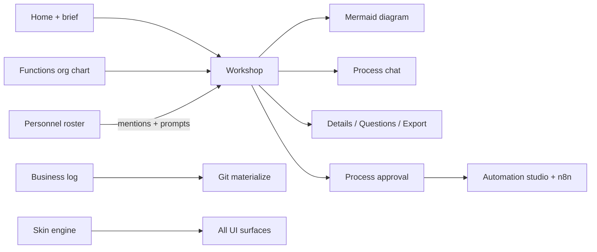
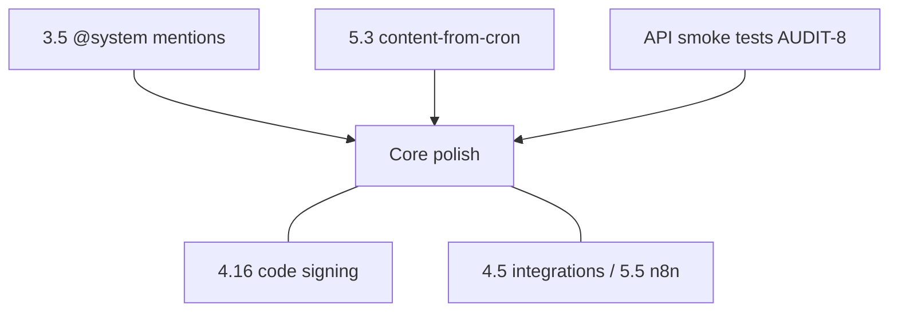

# Hermes Forge — Project Audit

**Version audited:** v0.2.0 (+ post-release WIP)  
**Audit date:** 2026-07-07  
**Remediation session:** 2026-07-07 (see [Remediation progress](#remediation-progress) below)

This document is the canonical repo health audit. It complements [`PRODUCT_BACKLOG.md`](PRODUCT_BACKLOG.md) (what to build) with an honest picture of mistakes, gaps, redundancy, and cleanup work.

---

## Remediation progress

Tracked in backlog as **AUDIT-1 … AUDIT-10** ([`PRODUCT_BACKLOG.md`](PRODUCT_BACKLOG.md#audit-remediation-2026-07-07)).

| ID | Task | Status | Notes |
|----|------|--------|-------|
| AUDIT-1 | Align `PRODUCT_BACKLOG.md` baseline with codebase | **Done** | Terminology section, 4.10–4.14, redirects, nav |
| AUDIT-2 | Personnel honesty pass | **Done** | Hire dialog + page copy; `[FIRE]` placeholders; `PersonnelIcon` removed; scaffold banner |
| AUDIT-3 | Remove legacy Interview flow | **Done** | Deleted `app/interview/page.tsx`, `app/api/extract/route.ts`; `/interview` → `/home` |
| AUDIT-4 | Merge Dashboard into Functions | **Done** | Org chart + analytics on `/functions`; dashboard page deleted; `/dashboard` → `/functions` |
| AUDIT-5 | Dev-gate God Mode | **Done** | Nav hidden by default; Settings → Developer toggle; route guard |
| AUDIT-6 | Dead code cleanup | **Mostly done** | accent.ts removed; next.config.mjs removed; accent-swatch CSS removed; optional theme export prune remains |
| AUDIT-7 | Schema honesty | **Done** | Decisions HITL API + UI + `decision.*` events (4.12); personnel git import done |
| AUDIT-8 | Repo hygiene | **Mostly done** | WAL gitignored; `npm test` unit smoke suite (17 tests via node:test); HTTP API smoke still optional |
| AUDIT-9 | Terminology pass | **Done** | `NewBusinessDialog`, shell `openNewBusiness`, auth copy, `process-card` / `recent-processes` CSS |
| AUDIT-10 | Personnel workshop integration | **Mostly done** | @-mentions + chat/diagram prompts + swimlane lanes; human edit PATCH; personnel git import; automation agent bind shipped; `@system` mentions still open |

---

## What you've actually built

Hermes Forge is a **v0.2.0 agent-native process-mapping studio** with a strong core loop and substantial peripheral surface area.

**Solid and shippable:**
- Home → brief → workshop flow (`app/api/start-from-brief/route.ts`, `components/home/HomeHero.tsx`)
- 2-column workshop + global chatbar (PR-5 absorption): streaming diagrams, node comments, discovery questions, conversation forks, message queue, rich composer (`app/(shell)/workshop/page.tsx`)
- Automations pipeline (approval → studio → n8n deploy) — backlog 4.4
- Business log + append-only events (`lib/business-log.ts`, `app/(shell)/log/page.tsx`)
- Full theme/skin engine (built-ins, JSON install, VS Code import) — backlog 4.6–4.9
- Electron desktop packaging (`electron/main.mjs`)
- Functions page: org chart + merged automation analytics (`app/(shell)/functions/page.tsx`, `components/functions/*`)

**Scaffold / disconnected (do not treat as complete):**
- Personnel — workshop mentions + prompts + automation agent bind shipped; `@system` mentions still open (4.10)

**Dev-gated tooling:**
- God Mode — diagram canvas overview (4.13)
- Cronalytics — Hermes cron observability (4.14)

**Shipped governance (was scaffold):**
- Decisions / HITL — forge lifecycle, pending inbox, notifications, `decision.*` log events (4.12)

---

## Most glaring mistakes

### 1. Feature islands — UI promises integration that doesn't exist (highest impact)

Features that look finished in navigation but don't participate in the core value chain.

| Feature | Risk | Current state (post-remediation) |
|---------|------|--------------------------------|
| Personnel | Hire copy implied workshop assignment | **Fixed** — workshop mentions + prompts wired; automation bind still open |
| Swimlane standard | Lanes from roster | **Partial** — diagram prompt prefers roster lanes when standard is swimlane/auto |
| Rich composer `@` mentions | Actor/department/system | **Partial** — actors + roles + diagram nodes; systems still open |
| BusinessDecision | Governance record | **Done** — HITL API, `/decisions`, forge gates, log events (4.12) |
| Git `personnel.json` | Round-trip import | **Done** — import restores personnel + docs + processes (4.11) |

### 2. Documentation drift — **largely fixed (AUDIT-1)**

`PRODUCT_BACKLOG.md` baseline was stale (old `/projects` paths, missing personnel/log/themes). Baseline and terminology section updated 2026-07-07. Keep backlog in sync when shipping features outside numbered items.

### 3. Terminology chaos — **UI pass done (AUDIT-9)**

| Concept | Database | UI label |
|---------|----------|----------|
| Tenant | `Business` | "business" (legacy: "project" in some components) |
| Workflow map | `Process` | "process" |
| Department | `Process.department` | "function" |

### 4. Nav rail overload — **partially fixed (AUDIT-4, AUDIT-5)**

Was 9 always-visible items including overlapping Functions / God Mode / Dashboard. Stage explorer thins the main rail; Log + Decisions stay in the holistic footer. God Mode and Cronalytics remain dev-gated.

### 5. Legacy discovery flow — **fixed (AUDIT-3)**

Interview + `/api/extract` removed. Primary flow: Home → `start-from-brief` → Workshop + Questions panel.

### 6. Schema ahead of product — **fixed for decisions (AUDIT-7)**

`BusinessDecision` + `DecisionRequest` + notifications have runtime API and UI (4.12). Unused `PERSONNEL_REMOVED` removed — fire uses `personnel.fired`. Personnel git import done. Inert Git mirror fields on `Business` unchanged.

### 7. Zero automated tests — **partial (AUDIT-8)**

Unit smoke suite: `npm test` → `tests/unit/*.test.ts` (process-md, templates, home-prompt, log types, export filename). No HTTP/SSE/Electron integration tests yet.

### 8. Repo hygiene — **mostly done (AUDIT-8)**

SQLite WAL sidecars gitignored; duplicate `next.config.mjs` removed; accent module removed; unit tests added.

### 9. Theme over-investment vs. BPM backlog — **partially addressed**

10 skins / VS Code import remain. PROCESS.md (4.2), template library (4.1), and PNG/PDF export (3.8) foundation shipped 2026-07-09.

### 10. Security footgun on test endpoints — **open**

`/api/hermes/test` and `/api/n8n/test` accept arbitrary `baseUrl` (SSRF risk on shared hosts).

---

## Missing features

### From backlog — still pending or partial

| ID | Item | Status |
|----|------|--------|
| 2.4 | Function status lifecycle badges | Deferred |
| 3.4 | Fork-from-message UI; delete/rename conversation | **Done** |
| 3.5 | `@department` / `@system` / actor mentionables | Partial |
| 3.8 | PNG/PDF export; server export API | **Done** (client PNG/PDF; server route deferred) |
| 4.1 | Workflow template library as repo files | **Done** |
| 4.2 | Per-business `PROCESS.md` contract | **Done** (generated + Git + chat inject) |
| 4.3 | Template marketplace / import | Pending |
| 4.5 | Integrations page | Pending |
| 4.12 | Business decisions / HITL | **Done** |
| 4.15 | Desktop multi-tab shell | **Done** — see `DESKTOP_MULTI_TAB_SHELL.md` |

### Needed for product coherence (not all in backlog)

1. Personnel ↔ process (assignees, swimlanes, chat/diagram context) — mostly done; `@system` still open
2. ~~Personnel ↔ automation (`hermesAgentProfileId`)~~ **done** (4.10)
3. ~~Human edit CRUD + show `roleDescription` on cards~~ **done**
4. ~~BusinessDecision implementation or schema removal~~ **done** (4.12 HITL)
5. ~~Git import round-trip (`personnel.json`, etc.)~~ **done** (4.11 push + restore import)
6. `ARCHITECTURE.md` reference doc (`PROCESS.md` schema ref shipped)
7. Minimal API smoke tests

---

## Redundant or safe to remove

### High confidence — dead code

| Item | Path | Status |
|------|------|--------|
| `HumanPersonnelCard` | `components/personnel/HumanPersonnelCard.tsx` | **Removed** |
| `PersonnelIcon` | `components/personnel/PersonnelIcon.tsx` | **Removed** |
| Interview page + extract API | `app/interview/`, `app/api/extract/` | **Removed** |
| Dashboard page | `app/(shell)/dashboard/page.tsx` | **Removed** (merged into Functions) |
| Accent preset API | `lib/accent.ts` | **Removed** (migration inlined in theme storage) |
| Dead accent swatch CSS | `app/globals.css` | **Removed** |
| Duplicate Next config | `next.config.mjs` vs `next.config.ts` | **Removed** `.mjs` |
| `PERSONNEL_REMOVED` event | `lib/business-log-types.ts` | **Removed** (use `personnel.fired`) |
| Unused theme exports | `lib/themes/*` | Pending |

### Medium confidence

| Item | Recommendation | Status |
|------|----------------|--------|
| God Mode in nav | Dev-gate | **Done** |
| Dashboard | Merge into Functions | **Done** |
| Duplicate skin picker | `SettingsMenu` → `<SkinPicker compact />` | Pending |
| `ThemeDesignSystemPreview` | Dev-gate or remove | Pending |
| Overlapping skin presets | Consolidate or add light palettes | Pending |

### Low confidence — keep, don't expand until wired

Cronalytics (dev-gated), VS Code theme import, optional theme export pruning.

---

## Recommended priority (remaining)

1. **3.5** — `@system` / department mentionables
2. **5.3** — content auto-create from cron; pause/resume run health
3. **4.16** code signing when shipping desktop
4. Optional: HTTP-level API smoke against a running server

---

## Bottom line

The **workshop core is strong**. 2026-07-07 fixed documentation truthfulness, personnel honesty, nav thinning, and overview consolidation. **2026-07-09** shipped PNG/PDF export, PROCESS.md foundation, template JSON library, terminology pass, and most dead-code cleanup. **HITL wave closed (4.12):** forge lifecycle, decision inbox, notifications, auto-propose, holistic nav, and `decision.*` log events. **Conversation forks complete (3.4).** Remaining work is **composer mentions (3.5)**, **Automate M0 polish (5.3)**, and **missing integration tests**.

---

*Original audit produced in agent session 2026-07-07. Previously stored only in an ephemeral Grok plan file; committed here as the canonical reference. Updated 2026-07-09 for Tier A implementation; 2026-07-13 for HITL wave close (4.12) and conversation fork completion (3.4).*